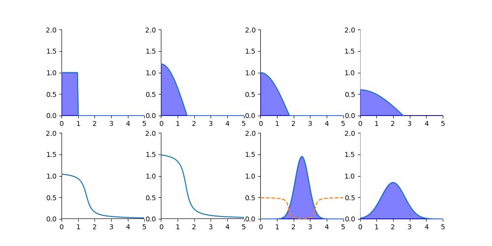

# Image_processing

Here, I will implement algorithms learned from the lecture "Mathematical Image Processing"

## Note: some code are purely "for loop" to provide an intuitive understanding of the algorithm

### Histogram

### Filters

### Upscaling

### Sim graph
approximation of some functions
