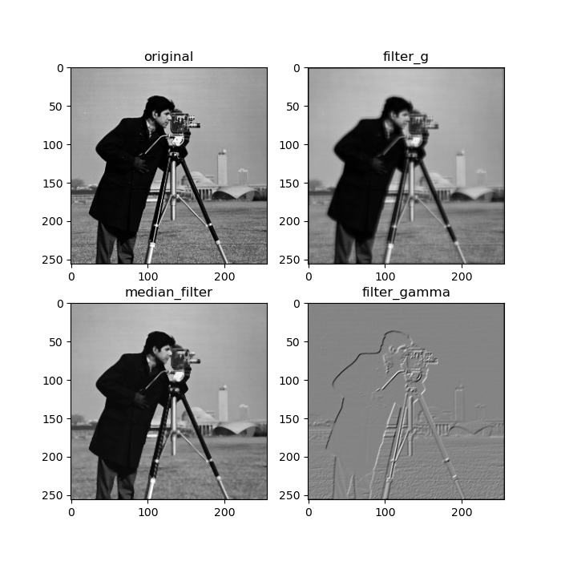

# Image Processing

This repository implements algorithms learned from the lecture "Mathematical Image Processing."

## Overview

In this project, we explore various image processing techniques.

## Requirements

To run this project, you need the following dependencies:

- Python 3.10
- Required Python packages (listed in `requirements.txt`):


## Installation

1. Clone the repository:
   ```bash
   git clone https://github.com/Haiyun314/Image_processing.git

2. You can install the required packages using:
    ```bash
    pip install -r requirements.txt

3. Create a build directory:
    ```bash
    mkdir build
    cd build
4. Run CMake::
    ```bash
    cmake ..

5. Build the project::
    ```bash
    cmake --build . --target RunMain

6. Run Tests:
    ```bash
    cmake --build . --target RunTests

## Usage
To run the algorithms, execute the appropriate Python scripts in the src directory. 
For example:
    ```bash
    python src/main.py

## Denoising Methods

### chan-vese segmentation

Chan-Vese segmentation is a technique for image segmentation that uses an energy minimization approach to detect and delineate object boundaries. It is particularly useful for images with weak edges or noisy backgrounds.

## Energy Function

The Chan-Vese algorithm works by minimizing an energy function that separates an image into regions. The energy function $ E(c_1, c_2, \phi) $ is defined as follows:

$$
E(c_1, c_2, \phi) = \int_\Omega (I(x, y) - c_1)^2 H(\phi) \, dx \, dy + \int_\Omega (I(x, y) - c_2)^2 (1 - H(\phi)) \, dx \, dy + \nu \int_\Omega |\nabla H(\phi)| \, dx \, dy
$$

where:

- $ I(x, y) $: Intensity of the image at the pixel location $ (x, y) $.
- $ c_1 $ and $ c_2 $: Average intensities inside and outside the contour.
- $ H(\phi) $: characteristic function applied to the level set function $ \phi $.
- $ \nu $: Regularization parameter controlling the smoothness of the contour.
- $ \Omega $: The entire image domain.


### Tikhonov Gradient and Tikhonov Fourier Denoise


### Histogram Analysis


### Filters



### Upscaling Techniques


